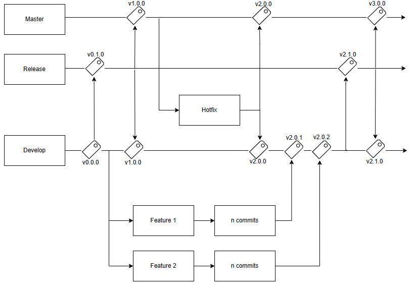
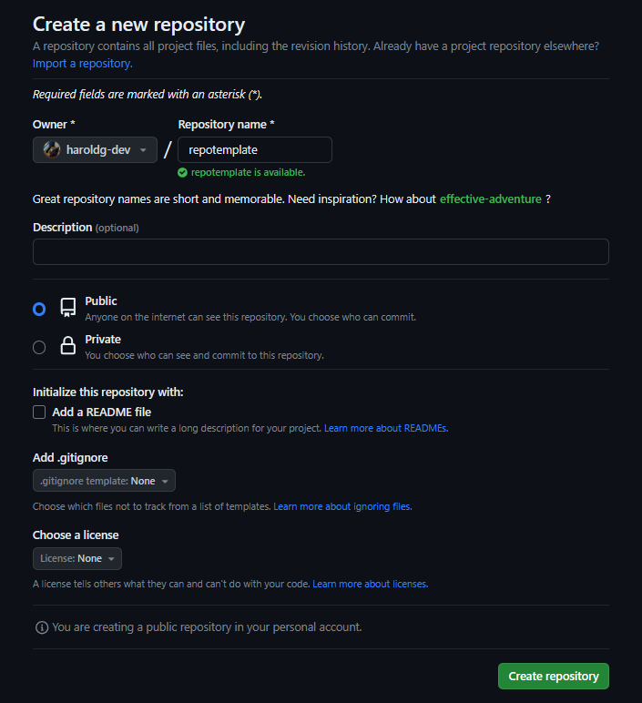
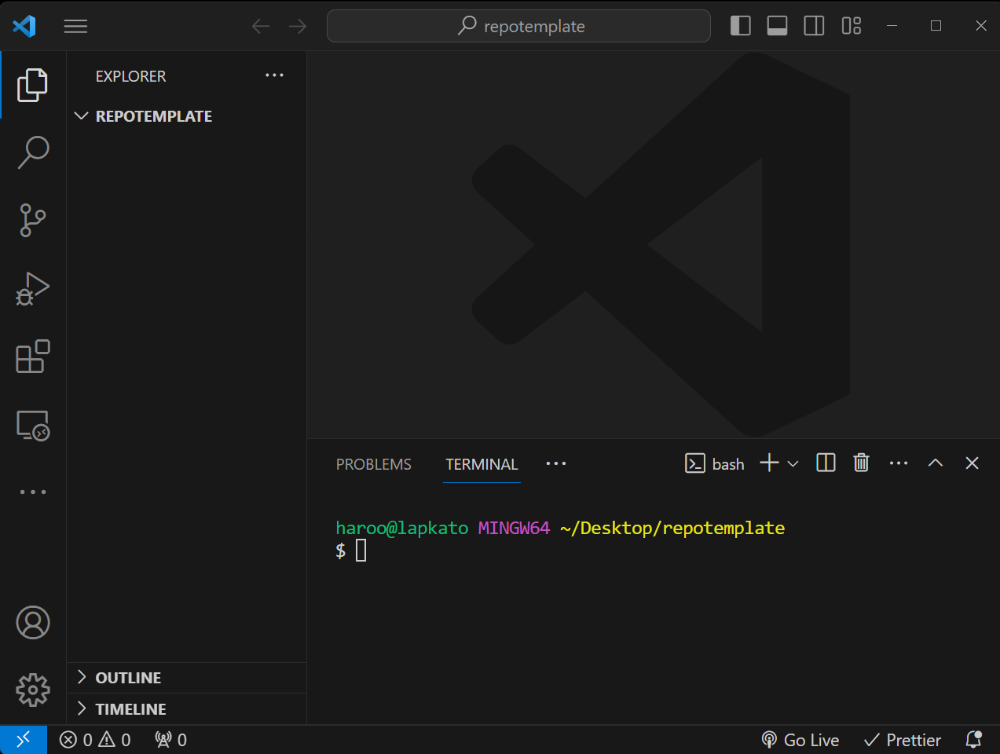
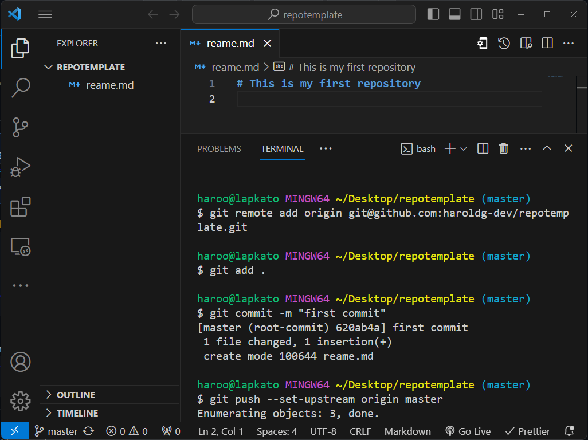

## Table of Contents

1. [Why use git?](#why-use-git)
   - [Commits](#commits)
   - [Branches](#branches)
   - [Repositories](#repositories)
2. [Getting Started with Git](#getting-started-with-git)
   - [Installation](#installation)
   - [Configuration](#configuration)
3. [Basic Git Project](#basic-git-project)
   - [Create a remote repository](#create-a-remote-repository)
   - [Initializing a local repository](#initializing-a-repository)
   - [Staging and Committing](#staging-and-committing)
   - [Branching and Merging](#branching-and-merging)
4. [Advanced Git Topics](#advanced-git-topics)
   - [Git Hooks](#git-hooks)
5. [Git Best Practices](#git-best-practices)
   - [Commit Messages](#commit-messages)
   - [Gitignore](#gitignore)
6. [Conclusion](#conclusion)
   - [Further Learning](#further-learning)

## Why use Git?

Git, created by Linus Torvalds, is the most widely used distributed version control system. Version control is crucial for tracking changes in a collaborative software development environment.

I know, it sounds too complicated but it's simple, let's put it in simple words.

Git is a tool that helps developers work together to create applications. Each developer can add their own feature to make the application better and git will keep everything neat and tidy.

### Commits

Git is like your photo album in your phone, why?, whenever you make a change to your code, Git creates a snapshot called **"commit"**. It's like taking a selfie of your code at that moment.

And guess what? You can have diffent albums of commits!, so if you want to go back in time to see how your code looked last Friday, Git will have all the commits (snapshots).

### Branches

In Git, branches are like different sub-albums inside of one main album. Each branch is a unique storyline for your code.



This is an example of a complete model branch:

- Master: This branch must only have stable a tested code to be deploy in a Production enviroment.
- Release: This branch have the code that will be deployed in a QA enviroment.
- Develop: This is the principal branch for development and here are the new features are integrated and tested in the Development enviroment.
- Feature: Each new feature must be develop in one feature branch created from develop and when the feature is done and tested, it fusion with develop.

### Repositories

Repositories are like main albums where you can keep all the branchs and snapshots of your code. Git lets you have your main album and share it too other friends to add them code and create new snapshots too.

The best part is that Git helps you and your friends to do it easily with simple **push** and **pull** commands.

## Getting Started with Git

### Installation

Begin by installing Git on your machine. Refer to the [official Git website](https://git-scm.com/) for installation instructions tailored to your operating system.

### Configuration

After installation, configure your Git settings, including your name and email address. Open your preference terminal and use the following commands:

```bash
git config --global user.name "Your Name"
git config --global user.email "your.email@example.com"
```

## Basic Git Project

### Create a Remote Repository

Choose any Git hosting platform like GitHub, GitLab, and Bitbucket to create your account and your repository.

For this example we're going to use Github.

[Link to create new account](https://github.com/joi)
[Link to create new repository](https://github.com/new)



### Initializing a Local Repository

We need to start a new local Git repository to link it to our remote repository, so create an empty folder in your local with the same name of your remote repository, open the folder with visual studio code and open the terminal as well.



Inside of the terminal you will type the next command to initialize the local repository.

```bash
git init
```

This creates a hidden .git directory to store the version history.

Then we have create a **readme.md** file with a simple title to procced to insert into the terminal the commands to push an existing repository from the command line that github gave you after you create your repo.

```bash
git remote add origin git@github.com:you-user/your-repo-name.git
git add .
git commit -m "first commit"
git push --set-upstream origin master
```

> 💡 **git remote** is the command that allow you to link your local repository with your remote repository.

At the end you should have something like this



### Staging and Committing

Use the following commands to stage and commit changes:

```bash
git add <filename>
git commit -m "Your commit message"
git push
```

> 💡 **git add** is the command to allow you to add files into the eyes of Git.

> 💡 **git commit** is the command to take a snapshot of your code in that momment and add a message as a description of it.

> 💡 **git push** is the commant to send your local code to your remote repository

### Branching and Merging

Create a new branch with:

```bash
git branch <branch-name>
```

Switch branches:

```bash
git checkout <branch-name>
```

Merge branches:

```bash
git merge <branch-name>
```

## Advanced Git Topics

### Git Hooks

Git hooks allow you to automate tasks. Explore the .git/hooks directory for pre-commit, post-commit, and other hooks.

## Git Best Practices

### Commit Messages

Write clear and concise commit messages. Follow the Conventional Commits standard for a structured approach.

### Gitignore

Create a .gitignore file to exclude files and directories from version control.

## Conclusion

Mastering Git is a journey that significantly enhances your ability to collaborate, track changes, and maintain a robust codebase. Dive into the vast world of Git and explore its features to become a proficient software developer.

### Further Learning

[Pro Git Book](https://git-scm.com/book/en/v2)

[GitHub Learning Lab](https://docs.github.com/en/get-started)

[Atlassian Git Tutorials](https://www.atlassian.com/git/tutorials)

> Happy coding 🔥
