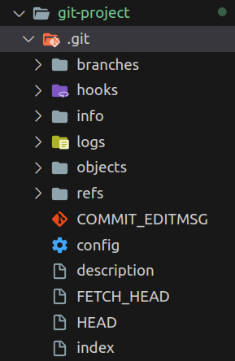
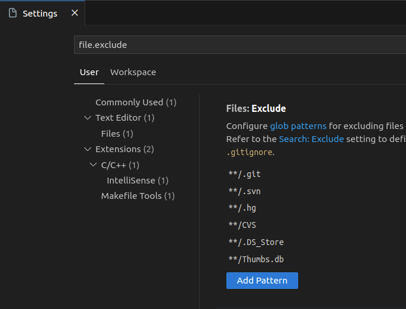
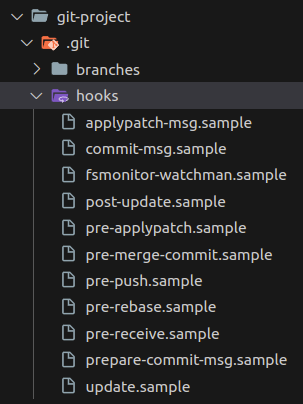
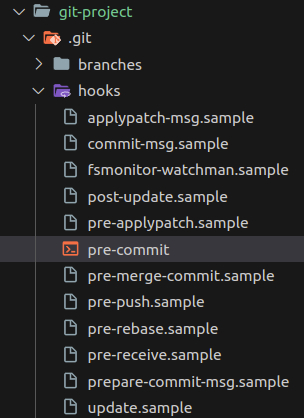
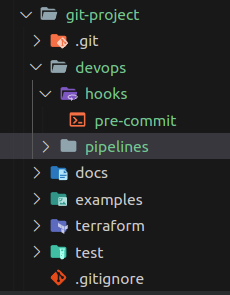

## Table of Contents

[What is Git Hooks?](#what-is-git-hooks)

- [Where is it?](#where-it-is)
- [How to see .git in vs code?](#how-to-see-git-in-vs-code)
- [pre-commit example](#pre-commit-example)
- [How to synchronize hooks with your team?](#how-to-synchronize-hooks-with-your-team)

[Further learning](#further-learning)

## What is Git Hooks?

### Where it is?

Git hooks reside within the hidden .git directory of your project. These hooks enable you to execute scripts at various points in the Git workflow.



### How to see .git in vs code?

Go to setting and looking for “file.exclude” and remove the pattern “\*\*/.git”.



Then go to your three project and you’ll see all the scripts samples to use the hooks.



### pre-commit example

To execute a script before you do a commit, you have to open the file “pre-commit.sample”, inside hook directory, and change the name to “pre-commit”, then edit the bash script as you want and saved.



This is a “pre-commit” example:

```jsx
#!/bin/sh

cd terraform/
tflint --chdir .
```

### How to synchronize hooks with your team?

The main problem to synchronize hooks with your team is that .git directory is exclude to the repository.
So we have to create our own hooks directory and then set it inside of git as the new path of hooks directory.

```jsx
git config core.hooksPath ./devops/hooks/
```



## Further Learning

[https://git-scm.com/docs/githooks](https://git-scm.com/docs/githooks)

[https://rjzaworski.com/2018/01/keeping-git-hooks-in-sync](https://rjzaworski.com/2018/01/keeping-git-hooks-in-sync)
