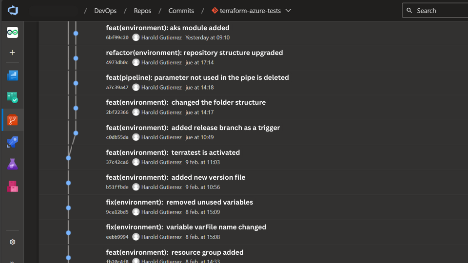

## Table of Contents

[What is a Commit?](#what-is-a-Commit)

[Conventionals Commits](#conventionals-commits)

- [Structural Elements of Commits](#structural-elements-of-commits)
- [Example Commits](#example-commits)
- [Note](#note)

[Further learning](#further-learning)

## What is a Commit?

A commit in the context of version control systems, such as Git, is a snapshot of changes made to a project's files. It represents a coherent set of modifications that are bundled together and recorded in the project's history.

When you make changes to files within a Git repository, you can stage those changes using the git add command. Once staged, you can commit them to the repository using the git commit command. Each commit typically includes a commit message that describes the changes made in that commit.



## Conventionals Commits

The Conventional Commits specification is a defined standard for commit messages. It provides a straightforward set of rules for creating an explicit and easily readable history. This specification aligns with Semantic Versioning (SemVer), describing "features," "fixes," and "breaking changes" made in commits.

```
Commit messages should follow the following structure:
   - <type>[scope]: <description>
```

### Structural Elements of Commits

1. Type: Defines the nature of the change. Some common examples include:

   - fix: fixing bugs
   - feat: new features
   - docs: documentation changes (docs/)
   - test: adding or modifying tests
   - refactor: code refactoring, no functionality change, shouldn't involve bug fixes
   - style: changes that do not affect the code (formatting, whitespace, etc.)
   - perf: code changes that improve performance
   - chore: changes to files unrelated to the framework's source code
   - revert: reverting a commit

2. Scope:
   Indicates the section or component of the infrastructure affected. It can be the name of the module, resource, or a specific area of the project.

3. Description:
   Provides a brief description of the change. Be clear and concise.

### Example Commits

Scope refers to the top-level folder where the change is made.

`<type>[scope]: <description>`

> - New Feature:
>
>   feat(vpc): add new module for creating a VPC.
>
> - Bug Fix:
>
>   fix(database): resolve error in database configuration.
>
> - Documentation:
>
>   docs(readme): update documentation to include usage examples.
>
> - Style:
>
>   style(format): apply formatting rules to all files.
>
> - Tests:
>
>   test(network): add integration tests for network modules.

### NOTE

1. If the commit does not match both scope and type, the PR will not be accepted, thus preventing merges into unrelated projects.
2. When the type and scope have the same name, it's not necessary to include the scope (e.g., docs).

By adhering to the Conventional Commits specification, teams can maintain a clear and consistent commit history, facilitating collaboration and understanding across projects.

## Further Learning

[https://www.conventionalcommits.org/en/v1.0.0/](https://www.conventionalcommits.org/en/v1.0.0/)

> Happy coding 🔥
